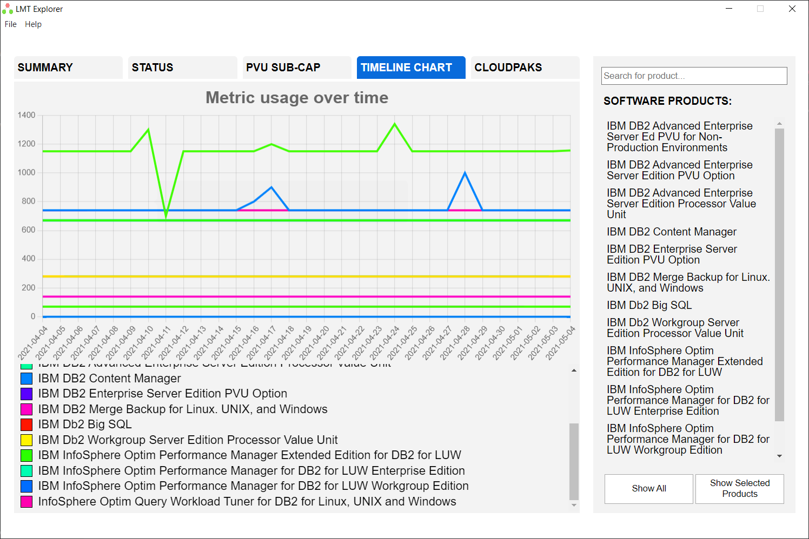

# LMT Explorer

This tool is used to visualize and make simpler reading [IBM License Metric Tool](https://www.ibm.com/docs/en/license-metric-tool) audit snapshot based on PVU sub-capacity metric.

**Note:** LMT Explorer is provided as-is, without any warranty, and without official support. This is a community project and not an official IBM tool.

## Installation

1. Go to the [releases](https://github.com/tstopa/LMT-Explorer/releases) site by clicking it on the right panel or adding `/releases` to the web address.
2. Download the installer [here](https://github.com/tstopa/LMT-Explorer/releases/download/1.0.0/LMT.Explorer-1.0.0.Setup.exe).
3. Run the installer and that's all.

## User's guide

1. When you open the program, you see a window, where you drop the [ILMT snapshot](https://www.ibm.com/docs/en/license-metric-tool?topic=utilization-creating-snapshots-license-metric-auditing-purposes) (zip archive).
2. Wait until the program loads the data and presents a diagram (this may take a while).
3. Then you will see 5 tabs and a navigation bar on the right. I am going to go through each of the tabs from left to right.
4. On the first tab you can see a simple table with information about each product name, its name, and metric quantity.
5. On the second tab you can see if there is something wrong with your audit snapshot. The first information is the dates of the first and last measurements taking. Then we can see if the snapshot includes all computers you have in license, will change color if not. Next is the ILMT version, which is green when right and yellow if a version is not one of the newest. The next information is about if we displayed all products in the file based on the filters we used. The next rubric displays if it did not miss a day in the timeline. The last three items of the table are very simple and mean exactly what they are named. First is displaying the percentage of computers that send data post set date. The second shows the percentage of computers that have capacity scans too late to count them and the last one is the percentage of computers that did not have scans performed.
   
6. Third tab we can see a visual presentation of provided audit snapshot, where:

-   Green triangles are products
-   Red circles are components
-   Yellow stars are virtual machines
-   Blue hexagons are physical servers

7. Under each product you can see its metric usage, and under each physical server, you can see metric usage per core.
8. You can pick every color shape, by clicking it and move it right and left, for easier analysis and an even better look.
9. By clicking on circle all its connections will be highlighted.
10. You can pick one (or more while holding CTRL) product and press the button on the right to see only selected products. They can be selected also on the search bar on the right. If you select one the view will zoom on it. If you want to go back to the view of all products simply press the Show All button.
    
11. On the fourth tab we can see a timeline of matric usage with the legend underneath it.
12. If you hover over a line you will see all products of the same value of metric in the hovered day.
13. If you want to see only one or a few products, select them on the right bar and press the Show Selected Products button. If you want to come back to all products simply press Show All button.
    
14. The last tab presents relations between cloudpak and products.

-   Purple squares are cloudpaks
-   Green triangles are products

15. Under each product we see its usage of metric, on connections are cloudpak usage of the metric and under each cloudpak we see its usage of metric.
16. As in tab three, you can choose products on the right (hold CTRL if you want to choose more than one) or on the picture. After pressing the Show Selected Products button, only chosen products will be seen.
17. If you click on any of the items, the connections between them will be highlighted.
18. You can pick every color shape, by clicking it and move it right and left, for easier analysis and an even better look.

## Information for developers

[Developer's guide](./DEVELOPER.md)
